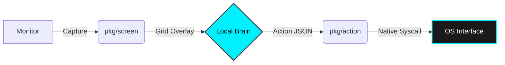

<p align="center">
  
</p>

<h1 align="center">GhostOperator (GO)</h1>

<p align="center">
  <strong>The local-first action agent that sees what you see, without APIs.</strong>
</p>

<p align="center">
  
  
  
  <a href="https://discord.gg/ghostoperator"></a>
</p>

---

## ⚡️ Quick Start (Universal Install)

Get up and running in seconds. No Python, no C++, no cloud keys.

<p align="center">
  <a href="https://github.com/TheAngelNerozzi/GhostOperator/releases/latest/download/ghost.exe">
    
  </a>
  <a href="https://github.com/TheAngelNerozzi/GhostOperator/releases/latest/download/ghost-darwin-arm64">
    
  </a>
  <a href="https://github.com/TheAngelNerozzi/GhostOperator/releases/latest/download/ghost-linux-amd64">
    
  </a>
</p>

### One-Line Install
**Windows (PS):** `irm https://cdn.jsdelivr.net/gh/TheAngelNerozzi/GhostOperator@main/scripts/install.ps1 | iex`

**Unix (Bash):** `curl -sSL https://cdn.jsdelivr.net/gh/TheAngelNerozzi/GhostOperator@main/scripts/install.sh | sh`

### Verify Installation
```bash
ghost --version
```

---

## 🧠 How it Works

GhostOperator acts as a high-speed neural bridge between multimodal AI models and your operating system.



---

## 🚀 Key Features

| Feature | Description |
| :--- | :--- |
| **🛡️ Privacy-First** | Zero cloud, zero telemetry. Your data never leaves your RAM. Optimized for local LMMs like Ollama. |
| **🏁 Grid Vision** | Advanced alphanumeric grid (A1, B2...) allows even the smallest AI models (Phi-3, Moondream) to hit targets with 100% precision. |
| **💨 Native Speed** | Built in pure Go. Sub-100ms latency from screen capture to action execution. No overhead, no interpreters. |
| **🛑 Safety Built-in** | Hardware-level Kill-Switch. Move your mouse or hit `Esc` to instantly regain manual control. |

---

## 🛠 Features for Developers

GhostOperator is designed to be highly extensible. You can build "Skills" that automate complex workflows (e.g., "Check my email and summarize Jira").

- **Modular Architecture**: Core logic in `/pkg`, easily importable.
- **Action Protocol**: Standardized JSON-RPC schema for easy integration with any LLM.
- **CGO-Free**: Compile to a single static binary on any platform.

---

## 🤝 Contributing

We are building the future of open-source automation. Whether it's adding a new OS syscall, optimizing the Grid system, or creating a new Skill, your contribution is welcome!

1. Star the repo.
2. Fork GhostOperator.
3. Check out [CONTRIBUTING.md](CONTRIBUTING.md).

---

<p align="center">
  Built with ❤️ by Angel Nerozzi & The GhostOperator Team.<br/>
  <i>Empowering humans with invisible automation.</i>
</p>
